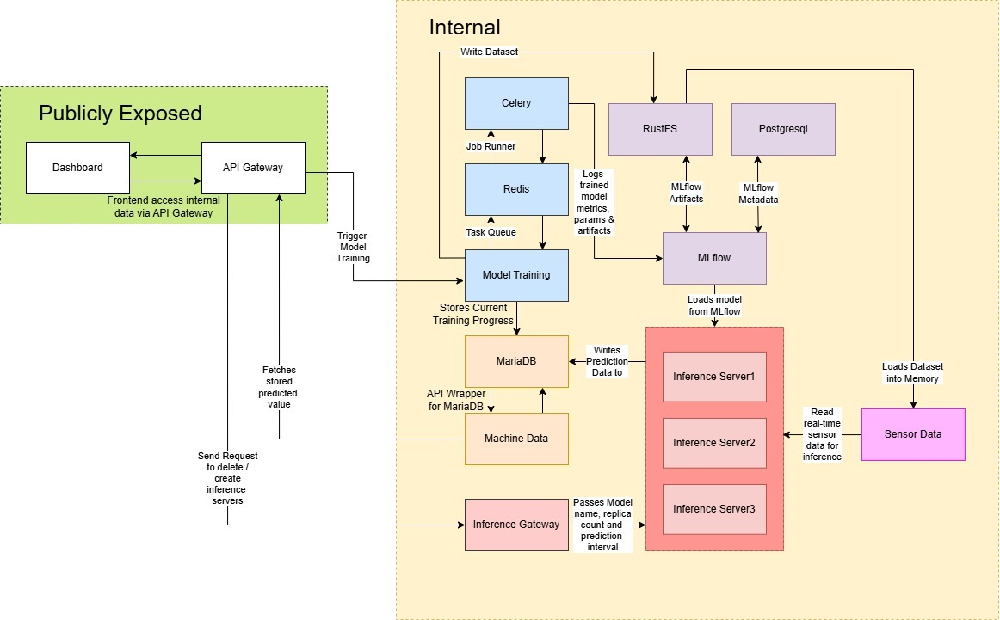

# ICANTKUBE 🥀🥀🥀

> [!TIP]
> Cluster is up and running!

## Useful Links

| Name | Purpose | Link |
|---|---|---|
| Website | Train Models | [https://home.icantkube.help/](https://home.icantkube.help/) |
| ArgoCD | Resource Deployment Dashboard | [https://argocd.icantkube.help/](https://argocd.icantkube.help/) |
| Mlflow | Manage Trained Models | [https://mlflow.icantkube.help/](https://mlflow.icantkube.help/) |
| Grafana | Compute Resource Utilisation Dashboard | [https://grafana.icantkube.help/](https://grafana.icantkube.help/) |
| Prometheus | Promtheus Querying | [https://prometheus.icantkube.help/](https://prometheus.icantkube.help/) |
| Kubebox | K8s Web Console | [https://kubebox.icantkube.help/](https://kubebox.icantkube.help/) |
| PHPMyAdmin | Manage MariaDB | [https://phpmyadmin.icantkube.help/](https://phpmyadmin.icantkube.help/) |
| RustFS | Manage Stored Objects | [https://rustfs.icantkube.help/](https://rustfs.icantkube.help/) |

# Project overview and objectives

## Problem Statement

How can we predict machine failure breakdown based on how many hours it has left by using sensor data such as temperature and humidity?

## System Architecture



### Model Pipeline

The model pipeline ingests sensor CSV data, kicks off asynchronous model training jobs, tracks artifacts and metrics in MLflow, and serves live predictions by creating per-model inference servers on demand; the frontend interacts through the API gateway to monitor machine state and control training and inference workflows.

### Microservices
| Microservice | Purpose |
| :--- | :--- |
| API Gateway | Routes `/api/{service}` requests to the correct internal model-pipeline service. |
| Frontend | Provides the UI to start training, manage inference servers, and view machine status. |
| Sensor Data | Streams the next sensor-data row from CSV datasets stored in object storage. |
| Model Train | Runs asynchronous model-training jobs and logs outputs to MLflow. |
| Inference Gateway | Creates, lists, and deletes model-specific inference-server deployments in Kubernetes. |
| Model Inference Server | Loads a trained model from MLflow and writes periodic predictions to MariaDB. |
| Machines Data | Exposes machine records and latest inference/training state from MariaDB. |

# Instructions to build and run system

## Prerequisites
- `minikube`
- `kubectl`
- `helm`
- `kubeseal`
- `argocd`
- `bash`

## Build and Run (Local)

> [!WARNING]
> The cluster requires **2CPU cores** and **8GB of RAM** at minimum to function properly, assuming no models would be trained. Please consider running it with at least **4CPU cores** and **12GB of RAM**.

Before installation,  plaintext secret files in `kubernetes/secrets` must be created:

| File Path | Keys to Set |
|---|---|
| `kubernetes/secrets/core/cloudflare-credentials.unsealed.yaml` | `account_id`, `api_token`, `tunnel_name` |
| `kubernetes/secrets/model-pipeline/mariadb-credentials.unsealed.yaml` | `MARIADB_ROOT_PASSWORD` |
| `kubernetes/secrets/model-pipeline/mlflow-credentials.unsealed.yaml` | `MLFLOW_FLASK_SERVER_SECRET_KEY`, `MLFLOW_TRACKING_USERNAME`, `MLFLOW_TRACKING_PASSWORD`, `username`, `password` |
| `kubernetes/secrets/model-pipeline/mlflow-postgresql-credentials.unsealed.yaml` | `username`, `password` |
| `kubernetes/secrets/model-pipeline/phpmyadmin-credentials.unsealed.yaml` | `PMA_USER`, `PMA_PASSWORD` |
| `kubernetes/secrets/model-pipeline/rustfs-credentials.unsealed.yaml` | `access_key_id`, `secret_access_key` |
| `kubernetes/secrets/visibility/grafana-auth-credentials.unsealed.yaml` | `username`, `password` |
| `kubernetes/secrets/visibility/kubebox-kubeconfig.unsealed.yaml` | Auto-generated by `infra/deploy-local.sh` from current Minikube kubeconfig |


When you run the deploy script, these secrets will be automatically sealed into matching `*.sealed.yaml` files by `kubeseal`.

From repo root:

```bash
export ARGOCD_ADMIN_USERNAME="<PREFFERRED_USERNAME>"
export ARGOCD_ADMIN_PASSWORD="<PREFFERRED_PASSWORD>"
bash infra/deploy-local.sh
```

What this does:
- Starts a local Minikube cluster
- Installs ArgoCD + Sealed Secrets, seals/apply repo secret, and bootstraps ArgoCD apps

To check if the cluster is up and running:

```bash
kubectl get nodes
```

# Dataset information and sources
[Dataset generated by Python code](https://drive.google.com/file/d/11xZdDKxhqxl8WgMiXw6g02fF2KH_edAg/view?usp=sharing)
```python
import random
import csv

rows = 5000
start_ttl = 720
step = start_ttl / rows

data = []

for i in range(rows):
    ttl = start_ttl - i * step
    
    # slight noise, otherwise follows formula
    temperature = 15 + (ttl * 0.05) + random.uniform(-2, 2)
    humidity = 80 - (ttl * 0.03) + random.uniform(-3, 3)
    air_quality = 50 + (ttl * 0.04) + random.uniform(-5, 5)
    pressure = 1000 + (ttl * 0.02) + random.uniform(-1, 1)
    wind_speed = 5 + (ttl * 0.01) + random.uniform(-0.5, 0.5)
    vibration = (720 - ttl) * 0.03 + random.uniform(-1, 1)
    
    data.append([
        round(humidity, 3),
        round(temperature, 3),
        round(air_quality, 3),
        round(pressure, 3),
        round(wind_speed, 3),
        round(vibration, 3),
        round(ttl, 3)
    ])

file_path = "./synthetic_ttl_dataset.csv"

with open(file_path, "w", newline="") as f:
    writer = csv.writer(f)
    writer.writerow([
        "humidity", 
        "temperature", 
        "air_quality", 
        "pressure", 
        "wind_speed", 
        "vibration", 
        "ttl"
    ])
    writer.writerows(data)
```

# Any known issues or limitations
- Inference servers load `models:/<MODEL_NAME>/latest`, so predictions depend on whichever version is currently marked latest in MLflow.
- API gateway routing is static (`kubernetes/apps/model-pipeline/api-gateway/config.yaml`), so config drift can break routing.
- The repo has no automated test coverage, so operational errors aren't spotted until they run on the cluster.
- Infra remains single-node k3s on one EC2 host, which is a single point of failure.
- Access to services exposed by ingress are reliant on Cloudflare. 

# Additional K8s Features

| Name | Purpose |
| :--- | :--- |
| ArgoCD | Syncs Kubernetes cluster state with manifests stored on Github. It automates deployments and detects state drift.                                                      |
| SealedSecrets | Encrypts Kubernetes Secret manifests so they can be safely stored on Github. Secrets are decrypted only by the cluster, thus protecting sensitive data.                                                                              |
| Cloudflare Ingress | Ingress that automatically creates and deletes Cloudflare Tunnels, which are used to expose web applications.                                                      |
| Dynamic LocalPV Provisioner | Automatically provisions PersistentVolumes when workloads request storage, simplifying local disk usage.                                                        |
| Prometheus | Scrapes metrics from Kubernetes and services for performance and health insight.                                                                             
| Autoscaling (HPA) | Automatically scales the number of pod replicas based on observed metrics like CPU/ memory or custom metrics to match demand.                                                                               |
| Argo Rollouts | Orchestrates advanced deployment strategies like blue-green or canary for  Kubernetes Deployments.                                                                      |
| KubeBox | Web Console to provide easy access to cluster resources and tools via a web UI.

# Table of K8s resources used

> [!NOTE]
> The resource counts in the tables below are calculated with this command 
`grep -hR --include='*.y*ml' --exclude='templated.yaml' '^kind:' kubernetes | sed 's/^kind:[[:space:]]*//' | sort | uniq -c`

## Native Resources
| Resource | Count | Example |
|----------|-------|------|
| Service | 14 | [Services](https://github.com/search?q=repo%3AHigherGround189%2Ficantkube+kind%3A+Service&type=code) |
| Secret | 13 | [Secrets](https://github.com/search?q=repo%3AHigherGround189%2Ficantkube+kind%3A+Secret&type=code) |
| Deployment | 11 | [Deployments](https://github.com/search?q=repo%3AHigherGround189%2Ficantkube+kind%3A+Deployment&type=code) |
| Namespace | 9 | [Namespaces](https://github.com/search?q=repo%3AHigherGround189%2Ficantkube+kind%3A+Namespace&type=code) |
| HorizontalPodAutoscaler | 6 | [HorizontalPodAutoscalers](https://github.com/search?q=repo%3AHigherGround189%2Ficantkube+kind%3A+HorizontalPodAutoscaler&type=code) |
| Ingress | 6 | [Ingresses](https://github.com/search?q=repo%3AHigherGround189%2Ficantkube+kind%3A+Ingress&type=code) |
| Kustomization | 6 | [Kustomizations](https://github.com/search?q=repo%3AHigherGround189%2Ficantkube+kind%3A+Kustomization&type=code) |
| ConfigMap | 4 | [ConfigMaps](https://github.com/search?q=repo%3AHigherGround189%2Ficantkube+kind%3A+ConfigMap&type=code) |
| ServiceAccount | 4 | [ServiceAccounts](https://github.com/search?q=repo%3AHigherGround189%2Ficantkube+kind%3A+ServiceAccount&type=code) |
| Job | 3 | [Jobs](https://github.com/search?q=repo%3AHigherGround189%2Ficantkube+kind%3A+Job&type=code) |
| StatefulSet | 3 | [StatefulSets](https://github.com/search?q=repo%3AHigherGround189%2Ficantkube+kind%3A+StatefulSet&type=code) |
| ClusterRole | 2 | [ClusterRoles](https://github.com/search?q=repo%3AHigherGround189%2Ficantkube+kind%3A+ClusterRole&type=code) |
| ClusterRoleBinding | 2 | [ClusterRoleBindings](https://github.com/search?q=repo%3AHigherGround189%2Ficantkube+kind%3A+ClusterRoleBinding&type=code) |
| DaemonSet | 1 | [DaemonSet](https://github.com/search?q=repo%3AHigherGround189%2Ficantkube+kind%3A+DaemonSet&type=code) |
| Role | 1 | [Role](https://github.com/search?q=repo%3AHigherGround189%2Ficantkube+kind%3A+Role&type=code) |
| RoleBinding | 1 | [RoleBinding](https://github.com/search?q=repo%3AHigherGround189%2Ficantkube+kind%3A+RoleBinding&type=code) |
| StorageClass | 1 | [StorageClass](https://github.com/search?q=repo%3AHigherGround189%2Ficantkube+kind%3A+StorageClass&type=code) |

## CRD Resouces
| Resource | Count | Example |
|---|---|---|
| Application | 24 | [Applications](https://github.com/search?q=repo%3AHigherGround189%2Ficantkube+kind%3A+Application&type=code) |
| Rollout | 9 | [Rollouts](https://github.com/search?q=repo%3AHigherGround189%2Ficantkube+kind%3A+Rollout&type=code) |
| SealedSecret | 7 | [SealedSecrets](https://github.com/search?q=repo%3AHigherGround189%2Ficantkube+kind%3A+SealedSecret&type=code) |
| ServiceMonitor | 1 | [ServiceMonitor](https://github.com/search?q=repo%3AHigherGround189%2Ficantkube+kind%3A+ServiceMonitor&type=code) |


# Folder Guide

Our repo consists of the following folders:
```bash
.
├── .github    # <-- Github Actions
├── infra      # <-- Terraform Files for Cloud Deployment
├── kubernetes # <-- K8s Manifest Files, tracked by ArgoCD
└── src        # <-- Application Source Code
```

## Infrastructure
The [infra/](infra/) folder contains all Terraform files used to spin up the cluster on an AWS EC2 Instance, along with a few convenience scripts

## Kubernetes 
The [kubernetes/](kubernetes/) folder stores all manifestfiles, and acts as the single source of truth for our kubernetes cluster. ArgoCD continuously watches the folder and automatically reconciles cluster resources to match what is committed in Git.

## Application Code
The [src/](src/) folder contains the source code for user-built microservices (AI inference, Website, Model Training, etc..)

# Image Auto-Build & Auto-Update
To improve developer experience, we use github actions to automatically build container images, and to update image tags in Kubernetes deployments. 

Auto update and auto build can be enabled once you have: 
 1. Added your image to [imageConfig.yaml](imageConfig.yaml).
 2. Named your dockerfile appropriately.   
 3. Created ```kustomization.yaml```.

### ImageConfig.yaml
To register your image for Auto-Build & Auto-Update, you must add it to [imageConfig.yaml](imageConfig.yaml) in this format:
```yaml
<imageName>:
  autoUpdate: true
  autoBuild: true
```

> [!IMPORTANT]
> Your image **MUST** be published by the [icantkube/ user](https://hub.docker.com/repositories/icantkube) on Dockerhub.

### Dockerfile Naming
Your Dockerfile must also be called ```image-name.Dockerfile```. For example, if your image name is ```backend```, your Dockerfile should be called ```backend.Dockerfile```. This is for the image builder to determine what to name your image.

### Deployment.yaml
The Auto Updater will not edit your ```deployment.yaml``` directly. Instead, it looks for a ```kustomization.yaml``` in the same directory.

Here is an example:
```bash
.
├── config.yaml
├── deployment.yaml
├── ingress.yaml
├── kustomization.yaml # <---
├── namespace.yaml
└── service.yaml
```

Here is a template for ```kustomization.yaml```:
```yaml
apiVersion: kustomize.config.k8s.io/v1beta1
kind: Kustomization

resources:
- config.yaml
- deployment.yaml
- ingress.yaml
- namespace.yaml
- service.yaml
# Make sure to put ALL your resources here

images:
- name: <imageName> #eg: icantkube/api-gateway
  newTag: <imageTag> #eg: v0.3

```
